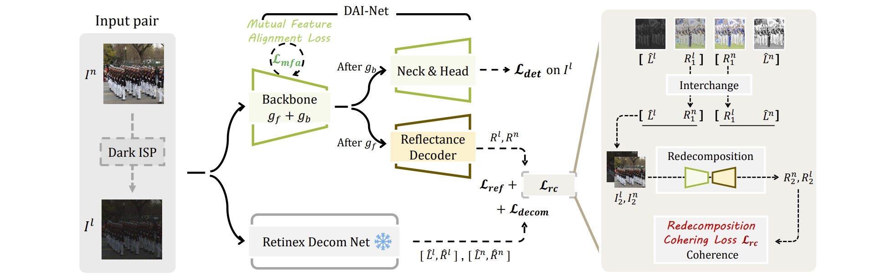

<p align="center">
  <h1 align="center">DAI-Net: Zero-Shot Day-Night Domain Adaptation for Person Detection</h1>
</p>

Adapted from **Boosting Object Detection with Zero-Shot Day-Night Domain Adaptation** (CVPR 2024) [[Paper](https://arxiv.org/abs/2312.01220)] by Zhipeng Du, Miaojing Shi, and Jiankang Deng.

This fork extends the original DAI-Net with a **YOLOv8n backbone** for lightweight person detection and targets deployment on **vast.ai RTX 5090 (Blackwell)** instances.



## Models

Four backbone variants are available via `models/factory.py`:

| Model key | Backbone | Description |
|-----------|----------|-------------|
| `vgg` | VGG16 DSFD | Original baseline |
| `dark` | VGG16 DSFD + Retinex | Original DAI-Net |
| `resnet50/101/152` | ResNet DSFD | Alternative backbones |
| `yolo_dark` | YOLOv8n + Retinex | Lightweight variant (~3.2M params) |

## Installation

### Option A: Local setup

```bash
git clone <repo-url>
cd DAI-Net

conda create -y -n dainet python=3.10
conda activate dainet

pip install torch torchvision --index-url https://download.pytorch.org/whl/cu128
pip install -r requirements.txt
```

### Option B: vast.ai (RTX 5090)

```bash
chmod +x setup.sh && ./setup.sh
```

This installs system packages, PyTorch with CUDA 12.8, Python dependencies, and verifies GPU compatibility.

## Dataset

The project uses a **Roboflow VOC-format** person detection dataset. Organize as:

```
dataset/
  roboflow/
    train/
      images/       # Training images
      annotations/  # Pascal VOC XML annotations
    valid/
      images/
      annotations/
    test/
      images/
      annotations/
```

Dataset paths are configured in `data/config.py`.

## Training

### YOLOv8n variant (recommended)

```bash
python train_yolo.py --batch_size 32 --num_workers 8 --amp true
```

Key flags:

| Flag | Default | Description |
|------|---------|-------------|
| `--batch_size` | 32 | Batch size (16 for 24GB VRAM, 32 for 32GB) |
| `--num_workers` | 8 | DataLoader workers |
| `--lr` | 1e-3 | Learning rate |
| `--amp` | true | Mixed precision (bf16 on Blackwell, fp16 fallback) |
| `--warmup_epochs` | 3 | Linear warmup epochs |
| `--val_interval` | 3 | Validate every N epochs |
| `--resume` | — | Path to checkpoint to resume from |

Training runs for 60 epochs with cosine annealing LR and EMA. Checkpoints are saved to `weights/yolo_dark/`.

**Loss function**: CIoU (detection) + BCE (classification) + Retinex reflectance decoding + EnhanceLoss + KL divergence alignment.

### Original DSFD variant

```bash
python -m torch.distributed.launch --nproc_per_node=$NUM_GPUS train.py
```

## Evaluation

### Comprehensive metrics

```bash
python evaluate_baseline.py
```

Generates `result/baseline_metrics.png` (precision-recall curve, F1 curve, FPS distribution, confidence distribution) and `result/baseline_results.txt`.

Configure paths and thresholds at the top of the script:
- `IMAGES_DIR` / `ANNOTATIONS_DIR`: test set location
- `USE_MULTI_SCALE`: multi-scale testing toggle
- `CONF_THRESH` / `IOU_THRESH`: detection thresholds

### Image inference

```bash
python test.py
```

Runs inference on a test image set with letterbox preprocessing (640x640). Supports multi-scale testing.

### Video inference

```bash
python test_video.py
```

Processes a video file with bounding box visualization and FPS display. Configure `VIDEO_INPUT`, `VIDEO_OUTPUT`, and `CONFIDENCE_THRESHOLD` in the script.

## ONNX Export

```bash
python export_onnx.py
```

Exports the DSFD model to `weights/dsfd_optimized.onnx` (opset 11, dynamic axes for variable resolution).

## Project Structure

```
DAI-Net/
  models/
    factory.py            # Model factory (build_net, basenet_factory)
    DAINet.py             # Original DSFD + Retinex
    DAINet_yolov8.py      # YOLOv8n + Retinex
    yolov8_modules.py     # Conv, C2f, SPPF, Bottleneck
    DSFD_vgg.py           # DSFD VGG backbone
    DSFD_resnet.py        # DSFD ResNet backbone
    enhancer.py           # RetinexNet (frozen decomposition)
  data/
    config.py             # Dataset paths, augmentation, anchors
    people_dataset.py     # Roboflow VOC-format loader
    widerface.py          # WIDER Face loader (legacy)
  layers/
    bbox_utils.py         # IoU, NMS, coordinate transforms
    modules/
      enhance_loss.py     # Retinex coherence losses
      multibox_loss.py    # Detection loss (CIoU + BCE)
    functions/
      detection.py        # Raw predictions to detections
      prior_box.py        # Anchor generation
  utils/
    DarkISP.py            # Low-light degradation simulator
    augmentations.py      # Image augmentation pipeline
  weights/                # Pretrained weights & checkpoints
  dataset/                # Training/validation/test data
  result/                 # Evaluation outputs
```

## Weights

| File | Description |
|------|-------------|
| `weights/decomp.pth` | Pretrained RetinexNet ([download](https://drive.google.com/file/d/1MaRK-VZmjBvkm79E1G77vFccb_9GWrfG/view?usp=drive_link)) |
| `weights/vgg16_reducedfc.pth` | VGG16 base network ([download](https://drive.google.com/file/d/1whV71K42YYduOPjTTljBL8CB-Qs4Np6U/view?usp=drive_link)) |
| `weights/yolo_dark/yolo_checkpoint.pth` | YOLOv8n training checkpoint |

## Citation

```bibtex
@inproceedings{du2024boosting,
  title={Boosting Object Detection with Zero-Shot Day-Night Domain Adaptation},
  author={Du, Zhipeng and Shi, Miaojing and Deng, Jiankang},
  booktitle={Proceedings of the IEEE/CVF Conference on Computer Vision and Pattern Recognition},
  pages={12666--12676},
  year={2024}
}
```

## Acknowledgement

Built upon [DSFD.pytorch](https://github.com/yxlijun/DSFD.pytorch), [RetinexNet_PyTorch](https://github.com/aasharma90/RetinexNet_PyTorch), [MAET](https://github.com/cuiziteng/ICCV_MAET), [HLA-Face](https://github.com/daooshee/HLA-Face-Code).
